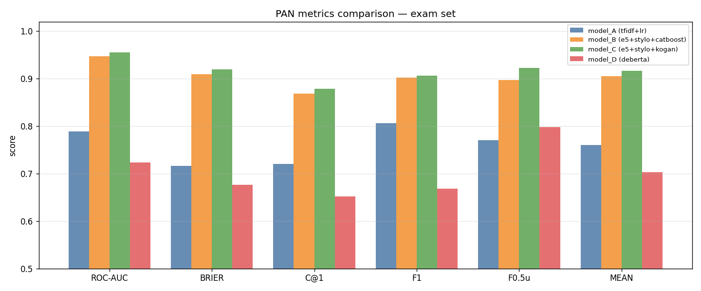
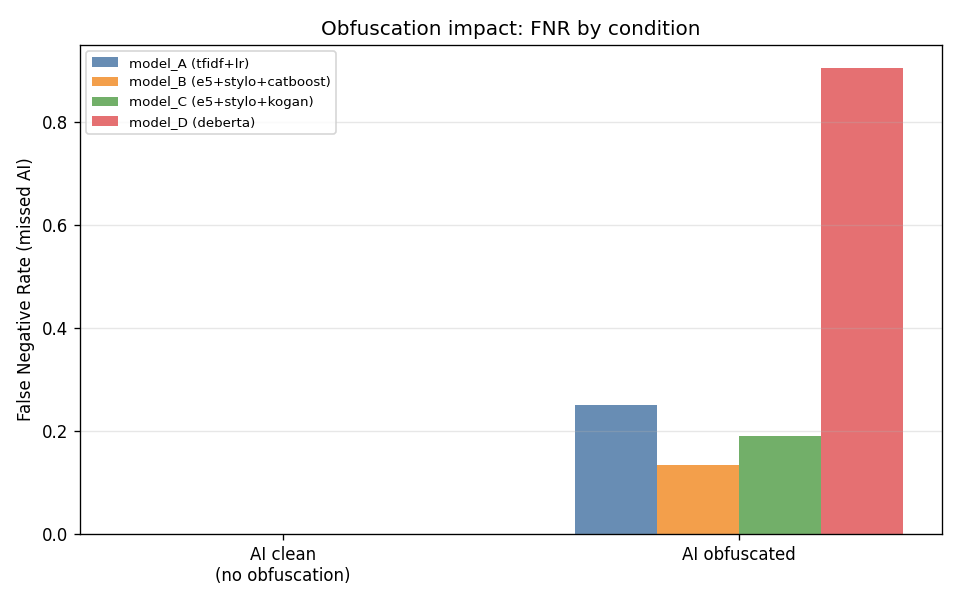
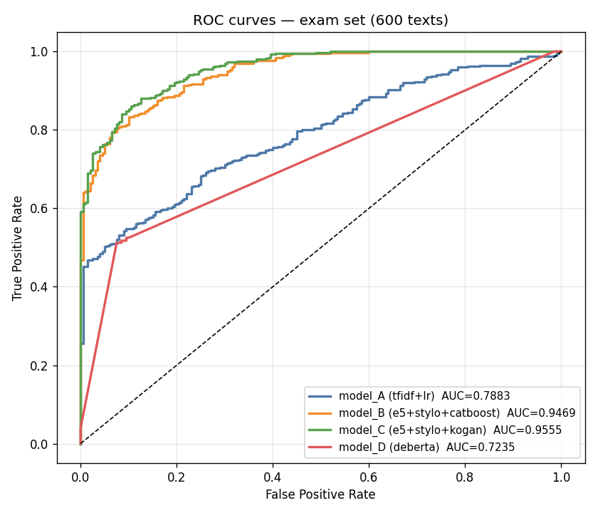
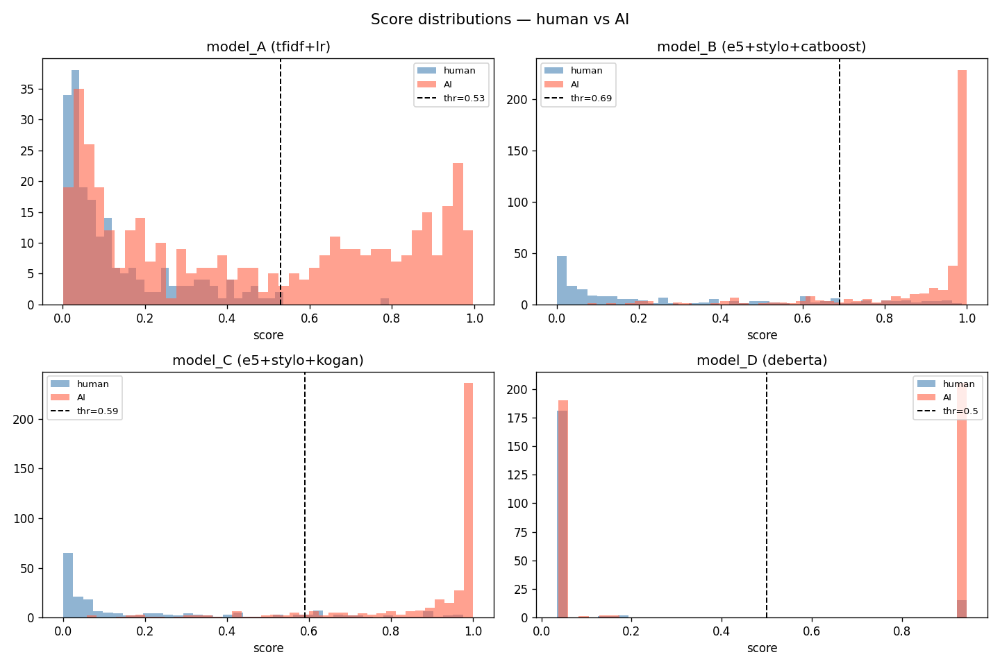

# Detecting Machine-Authored Text: PAN 2026 / NLP2 Exam Project

This repository contains the code, data construction notebooks, model experiments, and final evaluation for a Language Processing 2 exam project on binary AI-generated text detection.

The project addresses the PAN 2026 Voight-Kampff Generative AI Detection task as a binary classification problem: given an input text, predict whether it is human-authored or machine-authored. The models are trained on the PAN 2025 Voight-Kampff dataset and evaluated on a custom 600-text exam test set.

## Project overview

The final evaluation compares four independently evaluated systems:

| Model | Description |
|---|---|
| Model A | TF-IDF logistic regression baseline |
| Model B | CatBoost with E5 embeddings, stylometric features, POS-derived statistics, readability features, and genre |
| Model C | Extension of Model B with additional semantic cluster and Kogan-style features |
| Model D | Fine-tuned `microsoft/deberta-v3-large` sequence classifier |

The custom exam test set contains:

| Condition | N | Label |
|---|---:|---:|
| Human-authored | 200 | 0 |
| Plain GPT-4.1-generated | 200 | 1 |
| Obfuscated GPT-4.1-generated | 200 | 1 |
| Total | 600 | - |

The obfuscated AI texts were generated with genre-specific prompts designed to suppress known detector cues, including RLHF-style lexical markers and regular sentence or paragraph structure.

## Main results

The final result tables are stored in:

```text
exam/results/exam_overall.csv
exam/results/exam_by_condition.csv
exam/results/exam_by_genre.csv
```

Overall performance on the custom 600-text test set:

| Model | ROC-AUC | F1 | Mean | FPR | FNR |
|---|---:|---:|---:|---:|---:|
| Model A - TF-IDF + LR | 0.7883 | 0.6199 | 0.7102 | 0.0150 | 0.5475 |
| Model B - E5 + stylo + CatBoost | 0.9469 | 0.8951 | 0.9045 | 0.1600 | 0.1250 |
| Model C - E5 + stylo + Kogan | 0.9555 | 0.9059 | 0.9128 | 0.1800 | 0.0975 |
| Model D - DeBERTa | 0.7235 | 0.6613 | 0.7023 | 0.0750 | 0.4875 |

Model C achieved the best overall performance, followed closely by Model B. The main finding is that high validation performance did not guarantee robustness under targeted obfuscation. Model A and DeBERTa performed well on plain AI text but failed on obfuscated AI texts, each missing 92% of obfuscated AI examples. The feature-rich CatBoost models were substantially more robust.



Condition-level results:

| Model | Plain AI F1 | Plain AI FNR | Obfuscated AI F1 | Obfuscated AI FNR |
|---|---:|---:|---:|---:|
| Model A | 0.8967 | 0.175 | 0.1461 | 0.920 |
| Model B | 0.8926 | 0.065 | 0.8253 | 0.185 |
| Model C | 0.8972 | 0.040 | 0.8346 | 0.155 |
| Model D | 0.9356 | 0.055 | 0.1385 | 0.920 |

The condition-level results show that obfuscation affected the models unevenly. Models B and C degraded moderately, while Model A and DeBERTa almost collapsed under targeted obfuscation.



The ROC curves show the same overall pattern: the feature-rich CatBoost models separate human and AI texts much better than the TF-IDF baseline and DeBERTa on the custom test set.



The score distributions further illustrate the calibration and separation differences between the models.



## Final exam evaluation

The final exam evaluation is in:

```text
exam/exam_eval.ipynb
```

This notebook:

1. loads the custom 600-text test set;
2. checks the 200 / 200 / 200 condition split;
3. loads or reconstructs predictions for Models A-D;
4. applies validation-selected thresholds;
5. computes PAN-style metrics;
6. writes overall, condition-level, and genre-level result tables;
7. saves false-positive and false-negative files for error analysis.

The final prediction files are:

```text
exam/results/preds_model_A_exam.csv
exam/results/preds_model_B_exam.csv
exam/results/preds_model_C_exam.csv
exam/results/preds_model_D_exam.csv
```

Each prediction file contains the document metadata, true label, model score, thresholded prediction, genre, and condition.

## Data

The custom test data is stored in:

```text
test_data/dataset_600.csv
```

It contains 600 texts:

- 200 human-authored texts sampled from the provided human corpus;
- 200 plain GPT-4.1-generated texts;
- 200 GPT-4.1-generated texts with targeted obfuscation.

The AI texts were generated through the Azure OpenAI REST API using metadata derived from the selected human texts. The original human text was not provided directly to the model. The metadata included genre, approximate word count, sentence-length statistics, word-length statistics, type-token ratio, punctuation density, and topic keywords.

The data generation notebook is:

```text
test_data/test_dataset_creation.ipynb
```

The exploratory data analysis notebook is:

```text
test_data/eda_test_dataset.ipynb
```

## Models

### Model A: TF-IDF logistic regression

Model A combines word-level and character-level TF-IDF features:

- word unigrams and bigrams;
- character n-grams of length 3-5;
- sub-linear TF-IDF scaling;
- logistic regression with balanced class weights.

This model is used as a strong lexical baseline. It performs well on plain AI text but is vulnerable to targeted obfuscation.

### Model B: CatBoost with embeddings and stylometric features

Model B combines:

- E5 sentence embeddings;
- stylometric features;
- POS-derived statistics;
- readability features;
- genre as a categorical feature.

It is trained with CatBoost and provides a more robust feature-based detector than Model A.

### Model C: CatBoost with semantic cluster features

Model C extends Model B with semantic cluster features inspired by Kogan-style semantic path analysis. It adds features such as:

- nearest semantic cluster;
- distance to human and AI class centers;
- chunk-level semantic entropy;
- cluster probability distributions.

Model C is the best-performing system on the custom 600-text test set.

### Model D: DeBERTa-v3-large

Model D fine-tunes:

```text
microsoft/deberta-v3-large
```

It uses binary classification with a combined binary cross-entropy and ranking loss. The model performs strongly on plain GPT-4.1 outputs but fails under targeted obfuscation, suggesting sensitivity to distribution shift and surface-level stylistic manipulation.

## Metrics

The evaluation uses PAN-style metrics:

- ROC-AUC;
- Brier score complement;
- C@1;
- F1;
- F0.5u;
- mean score;
- false positive rate;
- false negative rate.

Thresholds were selected on the PAN validation set, not on the custom exam test set.

## Error analysis

The repository includes false-positive and false-negative files for all four models. These files are used for qualitative analysis of model failures.

One notable finding is that several false positives of Model C are human-authored fiction passages from Project Gutenberg, especially archaic or Shakespearean dramatic texts. This suggests that unusual human literary style can be misclassified as machine-authored when it differs strongly from the contemporary human writing distribution represented in the training data.

## Conclusion

In this study, we conducted a four-model evaluation of binary AI-generated text detection. We compared a TF-IDF logistic regression baseline with two CatBoost classifiers and a fine-tuned DeBERTa-v3-large model. All systems were trained using the PAN 2025 Voight-Kampff dataset and evaluated using a custom test set comprising 600 texts: 200 human-written texts, 200 plain GPT-4.1-generated texts and 200 GPT-4.1-generated texts produced using targeted, genre-specific obfuscation prompts.

The CatBoost models were the most robust on the custom test set. Model C achieved the best overall performance, followed closely by Model B; in contrast, the TF-IDF model and DeBERTa performed well on plain AI but not on obfuscated AI. This shows that high validation performance does not guarantee robustness under distribution shift. So reliable AI text detection requires the combination of multiple complementary signals, such as embeddings, stylometric features, part-of-speech (POS) statistics, readability measures and semantic cluster features, rather than relying mainly on lexical or contextual cues.

Error analysis also revealed that some archaic literary passages written by humans were misclassified as AI, suggesting that detectors may confuse human writing styles that are outside the training data with machine authorship. Therefore, future work should evaluate detectors on more diverse human writing styles, include human-edited adversarial examples and train on a wider range of obfuscation strategies.

## Repository structure

```text
.
├── ai_types_research/
│   └── Notes and supporting exploration related to AI text types.
│
├── baselines_exploration/
│   └── Exploratory PAN validation experiments:
│       TF-IDF, PPMD, Binoculars, stylometry, GLTR, semantic clustering,
│       E5 embeddings, and ensemble trials.
│
├── catboost_solution/
│   └── CatBoost training notebooks, saved CatBoost models, validation results,
│       and feature-importance plots.
│
├── deberta/
│   └── DeBERTa-v3-large fine-tuning notebook.
│
├── detectors/
│   └── Shared feature extraction and detector utilities.
│
├── test_data/
│   ├── dataset_600.csv
│   ├── test_dataset_creation.ipynb
│   └── eda_test_dataset.ipynb
│
└── exam/
    ├── exam_eval.ipynb
    └── results/
        ├── exam_overall.csv
        ├── exam_by_condition.csv
        ├── exam_by_genre.csv
        ├── preds_model_A_exam.csv
        ├── preds_model_B_exam.csv
        ├── preds_model_C_exam.csv
        ├── preds_model_D_exam.csv
        ├── model_A_false_positives.csv
        ├── model_A_false_negatives.csv
        ├── model_B_false_positives.csv
        ├── model_B_false_negatives.csv
        ├── model_C_false_positives.csv
        ├── model_C_false_negatives.csv
        ├── model_D_false_positives.csv
        ├── model_D_false_negatives.csv
        ├── plot_metrics_bar.png
        ├── plot_obfuscation_fnr.png
        ├── plot_roc.png
        └── plot_score_dist.png
```
